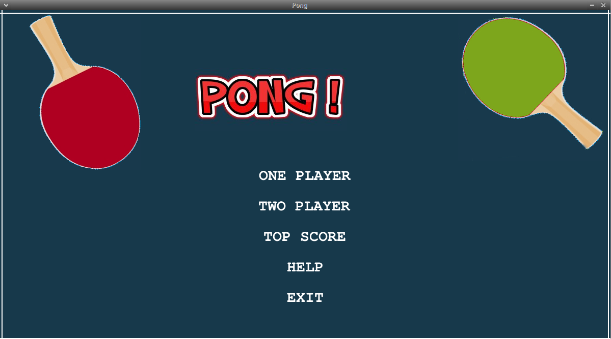

## INSTRUCTIONS

1. config file can be edited for giving names to Lift and Right Player
2. Currently there are 2 modes - One Player and Two Player
3. One Player is played against the computer. 
4. Each mode has 3 levels, with increasing difficulty (the paddle length decreases by 30 % in each level)

## SnapShot of the title page

   

